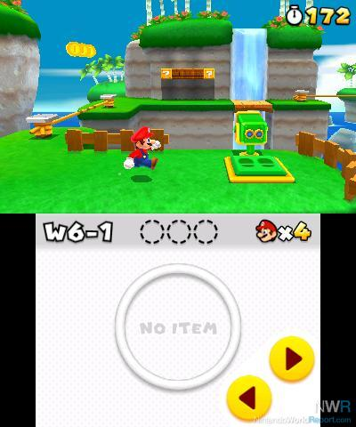

this repo is for when I get a spontaneous idea to make a game that I just do not have the mental space for at that moment but also can't stop thinking about it until I at least write it down

## retroplatformer

1. FIRST just implement a nice character controller, and FIRST FIRST just running. holding right makes you (slowishly, like 1sec) accelerate up to your run speed. if you are running for a long time, you switch to sprint mode which quickly accelerates you up to an even higher run speed. if you switch to holding left, you quickly decelerate to a stop before shooting off in the other direction without the long acceleration of starting from rest. if you switch to pressing down, you will slowly turn to run in that direction in a smooth arc.
2. greybox, make fun levels, prototype collectible candies (terrain is combo of gridmap and decoration meshes https://docs.godotengine.org/en/stable/tutorials/3d/using_gridmaps.html)

